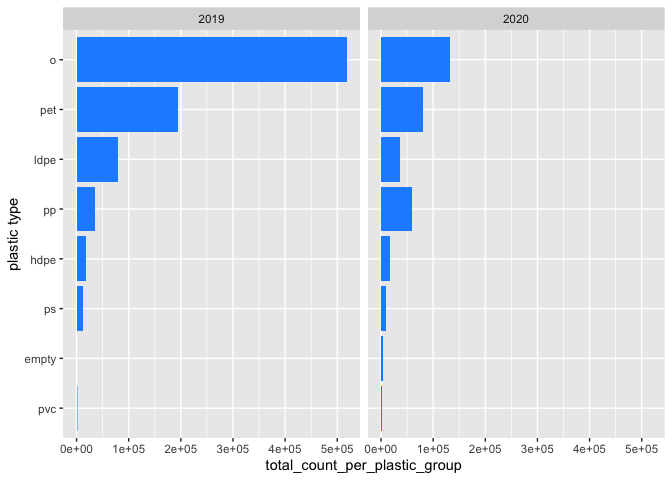
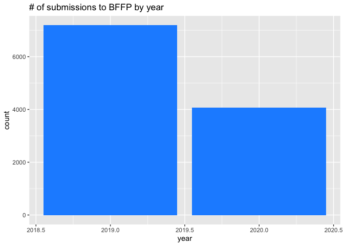
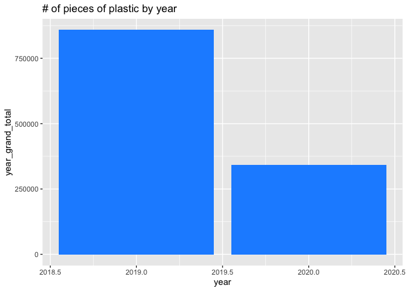
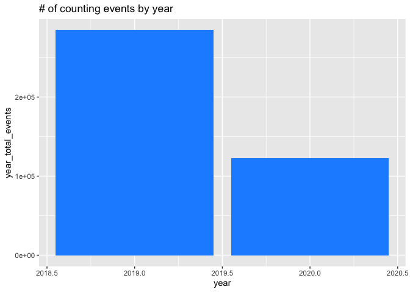
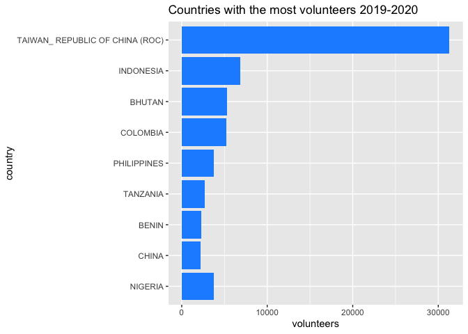
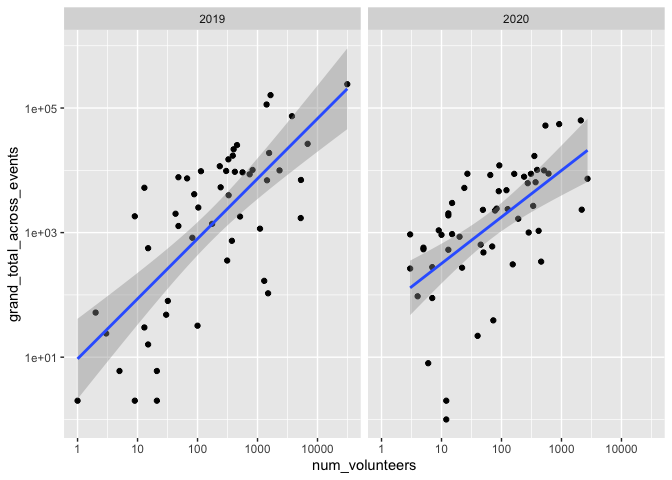
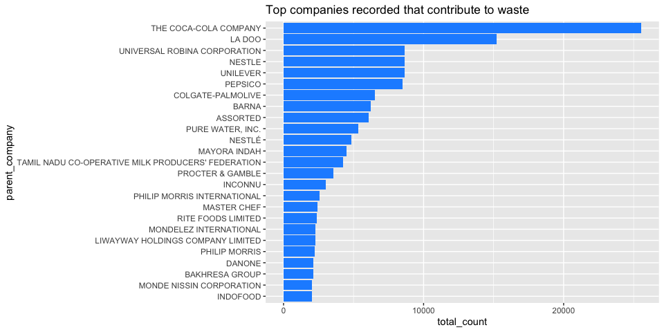
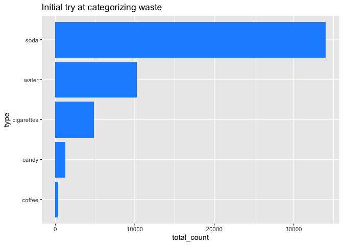

TidyTuesday 01-26-2021
================
Catalina Moreno
January 29, 2021

## Background

This data comes from the Break Free From Plastic (BFFP) initiative (via
TidyTuesday) and contains counts of plastic waste from a global audit
conducted by volunteers. The plastic waste is categorized per recycling
codes and the company that produced the waste is provided. This specific
data from BFFP spans 2019-2020.

## Read in data

``` r
## load libs
library(tidyverse)
```

Point to TidyTuesday GitHub to access
data:

``` r
plastics <- readr::read_csv('https://raw.githubusercontent.com/rfordatascience/tidytuesday/master/data/2021/2021-01-26/plastics.csv')

plastics %>% head() %>% knitr::kable()
```

| country   | year | parent\_company       | empty | hdpe | ldpe |   o |  pet |  pp |  ps | pvc | grand\_total | num\_events | volunteers |
| :-------- | ---: | :-------------------- | ----: | ---: | ---: | --: | ---: | --: | --: | --: | -----------: | ----------: | ---------: |
| Argentina | 2019 | Grand Total           |     0 |  215 |   55 | 607 | 1376 | 281 | 116 |  18 |         2668 |           4 |        243 |
| Argentina | 2019 | Unbranded             |     0 |  155 |   50 | 532 |  848 | 122 | 114 |  17 |         1838 |           4 |        243 |
| Argentina | 2019 | The Coca-Cola Company |     0 |    0 |    0 |   0 |  222 |  35 |   0 |   0 |          257 |           4 |        243 |
| Argentina | 2019 | Secco                 |     0 |    0 |    0 |   0 |   39 |   4 |   0 |   0 |           43 |           4 |        243 |
| Argentina | 2019 | Doble Cola            |     0 |    0 |    0 |   0 |   38 |   0 |   0 |   0 |           38 |           4 |        243 |
| Argentina | 2019 | Pritty                |     0 |    0 |    0 |   0 |   22 |   7 |   0 |   0 |           29 |           4 |        243 |

## Check the data

### uniqueness

Check if each country, year, parent\_company entry is unique:

``` r
plastics %>% count(country, year, parent_company) %>% filter(n > 1)
```

    # A tibble: 0 x 4
    # … with 4 variables: country <chr>, year <dbl>, parent_company <chr>, n <int>

Looks good. Assign unique identifier to support any further data
cleaning.

``` r
plastics <- plastics %>% mutate(uid = 1:n()) %>% 
  select(uid, everything())
```

### confirm `grand_total`

As each row is unique, group by `country`, `year`, `parent_company` and
check count across plastic rows is equivalent to `grand_total`.

Side note, first time trying `tidyr::pivot_longer()`as replacement to
`tidyr::gather()`\!

``` r
plastics %>% 
  tidyr::pivot_longer(!c(uid, country, year, parent_company, 
                         grand_total, num_events, volunteers)) %>% 
  group_by(uid, country, year, parent_company) %>% 
  summarise(grand_total = first(grand_total),
            total_check = sum(value)) %>% 
  filter(grand_total != total_check)
```

    # A tibble: 2 x 6
    # Groups:   uid, country, year [2]
        uid country                   year parent_company grand_total total_check
      <int> <chr>                    <dbl> <chr>                <dbl>       <dbl>
    1 11236 Korea                     2020 Dongsuh                 44          38
    2 12877 United States of America  2020 null                  4037        4034

Not bad, two observations with data entry issue, drop these.

``` r
mis_entry <- plastics %>% 
  tidyr::pivot_longer(!c(uid, country, year, parent_company, 
                         grand_total, num_events, volunteers)) %>% 
  group_by(uid) %>% 
  summarise(grand_total = first(grand_total),
            total_check = sum(value)) %>% 
  filter(grand_total != total_check) %>%
  pull(uid)

plastics <- plastics %>% filter(!uid %in% mis_entry)
```

### check zero or NA grand\_total

Confirm each entry has at least one count (in `grand_total`):

``` r
plastics %>% filter(is.na(grand_total) | grand_total == 0) %>% nrow()
```

    [1] 2123

Update data set to only have `grand_total > 0`:

``` r
plastics <- plastics %>% filter(grand_total > 0)
```

### parent\_company

As this is volunteer-submitted data that includes multiple
countries/languages, differences in how `parent_company` is entered is
likely. Convert to all caps as first step to standardize, though more
text processing would be
useful.

``` r
plastics <- plastics %>% mutate(parent_company = str_to_upper(parent_company))
```

A first skim of data set top counts, shows `NULL` and `UNBRANDED` and
`GRAND TOTAL`

``` r
plastics %>% select(parent_company, grand_total) %>% 
  arrange(desc(grand_total)) %>% 
  head(n = 10)
```

    # A tibble: 10 x 2
       parent_company grand_total
       <chr>                <dbl>
     1 GRAND TOTAL         120646
     2 UNBRANDED           120632
     3 GRAND TOTAL          80570
     4 GRAND TOTAL          56955
     5 GRAND TOTAL          37016
     6 UNBRANDED            31331
     7 NULL                 30200
     8 UNBRANDED            29571
     9 UNBRANDED            29486
    10 NULL                 19217

I (naively checked if `GRAND TOTAL` and `UNBRANDED` are companies…) but
cross-referencing the great Shiny app published on the BFFP page (scroll
down)
[here](https://www.breakfreefromplastic.org/globalbrandauditreport2020/)
for the US data entry in 2020:

``` r
## can reproduce shiny?
plastics %>% 
  filter(country %in% 'United States of America', year %in% '2020') %>%
  arrange(desc(grand_total)) %>% 
  select(parent_company, year, grand_total) %>% 
  head()
```

    # A tibble: 6 x 3
      parent_company         year grand_total
      <chr>                 <dbl>       <dbl>
    1 UNBRANDED              2020        5299
    2 THE KROGER COMPANY     2020         500
    3 PEPSICO                2020         440
    4 THE COCA-COLA COMPANY  2020         247
    5 NESTLE                 2020         223
    6 STARBUCKS              2020         138

As `UNBRANDED` and `NULL` are not in this app, assume these are invalid
entries for
`parent_company`.

``` r
# plastics <- plastics %>% filter(!parent_company %in% c("UNBRANDED", "NULL", "GRAND TOTAL"))
```

### country

Also capitalize country:

``` r
plastics <- plastics %>% mutate(country = str_to_upper(country))
```

## Exploratory data analysis

### country

``` r
plastics %>% distinct(country) %>% nrow()
```

    [1] 67

Visualize top 10:

``` r
plastics %>% 
  count(country) %>% arrange(desc(n)) %>% 
  head(n =10)
```

    # A tibble: 10 x 2
       country                      n
       <chr>                    <int>
     1 EMPTY                     1346
     2 CHINA                      838
     3 UKRAINE                    829
     4 PHILIPPINES                785
     5 VIETNAM                    785
     6 INDONESIA                  728
     7 NIGERIA                    679
     8 UNITED STATES OF AMERICA   580
     9 HONG KONG                  550
    10 INDIA                      490

`country == EMPTY` highlights another flag with data entry.

### plastic types

``` r
plastics %>% 
  tidyr::pivot_longer(!c(uid, country, year, parent_company, 
                         grand_total, num_events, volunteers)) %>% 
  group_by(year, name) %>% 
  summarise(total_count_per_plastic_group = sum(value, na.rm = TRUE)) %>% 
  ggplot(mapping = aes(x = forcats::fct_reorder(name, total_count_per_plastic_group), 
                       y = total_count_per_plastic_group)) + 
  geom_col(fill = "dodgerblue") + coord_flip() + facet_wrap(~year) +
  labs(x = "plastic type")
```

<!-- -->

What are the implications of categorizing plastic as other?

### year

2019 to 2020 plastic count due to less plastic / COVID, or due to less
volunteers?

``` r
plastics %>% 
  ggplot(mapping = aes(x = year)) + geom_bar(fill = "dodgerblue") +
  labs(title = "# of submissions to BFFP by year")
```

<!-- -->

``` r
## # pieces of plastic
plastics %>% 
  group_by(year) %>% summarise(year_grand_total = sum(grand_total)) %>% 
  ggplot(mapping = aes(x = year, y = year_grand_total)) + geom_col(fill = "dodgerblue") +
  labs(title = "# of pieces of plastic by year")
```

<!-- -->

``` r
## # of events
plastics %>% 
  group_by(year) %>% summarise(year_total_events = sum(num_events)) %>% 
  ggplot(mapping = aes(x = year, y = year_total_events)) + geom_col(fill = "dodgerblue") +
  labs(title = "# of counting events by year")
```

<!-- -->

### parent\_company

``` r
plastics %>% 
  count(parent_company) %>% arrange(desc(n)) %>% 
  head(n = 10)
```

    # A tibble: 10 x 2
       parent_company             n
       <chr>                  <int>
     1 UNBRANDED                 80
     2 THE COCA-COLA COMPANY     79
     3 PEPSICO                   64
     4 UNILEVER                  57
     5 MONDELEZ INTERNATIONAL    53
     6 GRAND TOTAL               52
     7 NULL                      50
     8 MARS, INCORPORATED        47
     9 COLGATE-PALMOLIVE         37
    10 NESTLE                    36

text processing needed for parent company, for example:

``` r
plastics %>% 
  filter(str_detect(parent_company, "PHILIP MORRIS")) %>%
  distinct(parent_company)
```

    # A tibble: 5 x 1
      parent_company              
      <chr>                       
    1 PHILIP MORRIS               
    2 L&M (PHILIP MORRIS)         
    3 CHESTERFIELD (PHILIP MORRIS)
    4 HEETS (PHILIP MORRIS)       
    5 PHILIP MORRIS INTERNATIONAL 

### data collection

Since each row represents the count pertaining to a `parent_company` it
does not capture a specific count event. Data is entered yearly.

Which country has the most volunteers combined across 2019 and 2020?

``` r
plastics %>% 
  count(country, volunteers, num_events) %>% 
  arrange(desc(volunteers)) %>% 
  head(n = 10) %>% 
  # arrange(desc(volunteers))
  ggplot(mapping = aes(x = forcats::fct_reorder(country, volunteers),
                       y = volunteers)) +
  geom_col(fill = "dodgerblue") + coord_flip() + 
  labs(x = "country", title = "Countries with the most volunteers 2019-2020")
```

<!-- -->

Nice effort across these countries\!

Next visualize the relationship between \# of volunteers and \# of
documented pieces of plastic waste:

``` r
plastics %>% 
  group_by(country, year) %>% 
  summarise(num_volunteers = unique(volunteers),
            grand_total_across_events = sum(grand_total)) %>% 
  ggplot(mapping = aes(x = num_volunteers, y = grand_total_across_events)) + 
  geom_point() +
  scale_y_log10() + scale_x_log10() + geom_smooth(method = "lm") +
  facet_wrap(~year) + labs("#counted plastic waste vs. # volunteers")
```

<!-- -->

As expected, there is a positive relationship between the number of
volunteers and the number of counted pieces of plastic waste. Call for
more volunteers\!

### source of plastic

Identifying top contributors to plastic waste is important to
highlighting order to understand where our waste is coming from and try
to improve:

``` r
plastics %>% 
  group_by(parent_company) %>% summarise(total_count = sum(grand_total)) %>% 
  arrange(desc(total_count)) %>% 
  filter(total_count > 2000) %>% 
  mutate(parent_company = str_sub(parent_company, 1, 50)) %>% # cutoff length for presentation purposes
  filter(!parent_company %in% c("GRAND TOTAL", "NULL", "UNBRANDED")) %>% 
  ggplot(mapping = aes(x = forcats::fct_reorder(parent_company, total_count),
                       y = total_count)) + geom_col(fill = "dodgerblue") + coord_flip() +
  labs(x = "parent_company", title = "Top companies recorded that contribute to waste") 
```

<!-- -->

As mentioned earlier, text processing of companies to clean up and
categorize into high-level groups could help narrow in on biggest source
/ where to focus efforts.

For an initial check, try categorizing by water, soda (coke and pepsi),
coffee (starbucks), cigarettes (philip moris), candy (mars):

``` r
plastics %>% 
  mutate(parent_company = str_to_upper(parent_company)) %>% 
  mutate(type = ifelse(str_detect(parent_company, "WATER"), "water", NA),
         type = ifelse(str_detect(parent_company, "PEPSI|COCA-COLA"), "soda", type),
         type = ifelse(str_detect(parent_company, "PHILIP MORRIS"), "cigarettes", type),
         type = ifelse(str_detect(parent_company, "MARS"), "candy", type),
         type = ifelse(str_detect(parent_company, "STARBUCKS"), "coffee", type)) %>% 
  filter(!is.na(type)) %>% 
  group_by(type) %>% summarise(total_count = sum(grand_total)) %>% 
  arrange(desc(total_count)) %>% 
  ggplot(mapping = aes(x = forcats::fct_reorder(type, total_count),
                       y = total_count)) + geom_col(fill = "dodgerblue") + coord_flip() + 
  labs(x = "type", title = "Initial try at categorizing waste")
```

<!-- -->

Although categorizing could help focus campaigns, it doesn’t show
responsible companies (which I view as a limitation).

## Summary

This data set helps bring awareness to plastic pollution per BFFP
initiative. Very cool that volunteers contribute the data\! Looking
forward to monitoring the [BFFP
website](https://www.breakfreefromplastic.org/globalbrandauditreport2020/)
