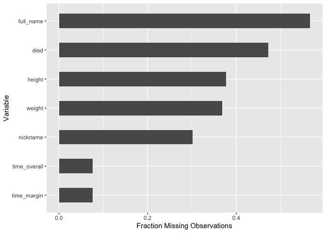
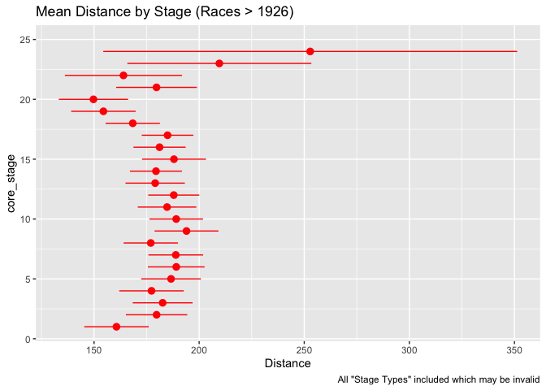

Tidy Tuesday 04-07-2020
================
Catalina Moreno
April 10, 2020

## Load libs

``` r
library(tidyverse)
```

## Read in data

``` r
stage_dat <- read_csv("https://raw.githubusercontent.com/rfordatascience/tidytuesday/master/data/2020/2020-04-07/stage_data.csv")

tdf_stages <- read_csv("https://raw.githubusercontent.com/rfordatascience/tidytuesday/master/data/2020/2020-04-07/tdf_stages.csv")

tdf_winners <- read_csv("https://raw.githubusercontent.com/rfordatascience/tidytuesday/master/data/2020/2020-04-07/tdf_winners.csv")
```

## tdf\_winners data

``` r
tdf_winners %>% glimpse()
```

    Observations: 106
    Variables: 19
    $ edition       <dbl> 1, 2, 3, 4, 5, 6, 7, 8, 9, 10, 11, 12, 13, 14, 15, 16, …
    $ start_date    <date> 1903-07-01, 1904-07-02, 1905-07-09, 1906-07-04, 1907-0…
    $ winner_name   <chr> "Maurice Garin", "Henri Cornet", "Louis Trousselier", "…
    $ winner_team   <chr> "La Française", "Conte", "Peugeot–Wolber", "Peugeot–Wol…
    $ distance      <dbl> 2428, 2428, 2994, 4637, 4488, 4497, 4498, 4734, 5343, 5…
    $ time_overall  <dbl> 94.55389, 96.09861, NA, NA, NA, NA, NA, NA, NA, NA, 197…
    $ time_margin   <dbl> 2.98916667, 2.27055556, NA, NA, NA, NA, NA, NA, NA, NA,…
    $ stage_wins    <dbl> 3, 1, 5, 5, 2, 5, 6, 4, 2, 3, 1, 1, 1, 4, 2, 0, 3, 4, 4…
    $ stages_led    <dbl> 6, 3, 10, 12, 5, 13, 13, 3, 13, 13, 8, 15, 2, 14, 14, 3…
    $ height        <dbl> 1.62, NA, NA, NA, NA, NA, 1.78, NA, NA, NA, NA, NA, NA,…
    $ weight        <dbl> 60, NA, NA, NA, NA, NA, 88, NA, NA, NA, NA, NA, NA, NA,…
    $ age           <dbl> 32, 19, 24, 27, 24, 25, 22, 22, 26, 23, 23, 24, 33, 30,…
    $ born          <date> 1871-03-03, 1884-08-04, 1881-06-29, 1879-06-05, 1882-1…
    $ died          <date> 1957-02-19, 1941-03-18, 1939-04-24, 1907-01-25, 1917-1…
    $ full_name     <chr> NA, NA, NA, NA, "Lucien Georges Mazan", "Lucien Georges…
    $ nickname      <chr> "The Little Chimney-sweep", "Le rigolo (The joker)", "L…
    $ birth_town    <chr> "Arvier", "Desvres", "Paris", "Moret-sur-Loing", "Pless…
    $ birth_country <chr> "Italy", "France", "France", "France", "France", "Franc…
    $ nationality   <chr> " France", " France", " France", " France", " France", …

Add
year:

``` r
tdf_winners <- tdf_winners %>% mutate(year = lubridate::year(start_date))
```

Can see some missingness. Check:

``` r
tdf_winners %>% purrr::map_df(function(x) {sum(is.na(x))}) %>% 
  gather() %>% 
  filter(value > 0) %>% 
  ggplot(mapping = aes(x = fct_reorder(key, value), y = value/nrow(tdf_winners))) + 
  geom_col(width = 0.5) + 
  coord_flip() + labs(x = "Variable", y = "Fraction Missing Observations")
```

<!-- -->

Have winners, but do not have time\_overall or time\_margin? Check:

``` r
tdf_winners %>% filter(is.na(time_overall)) %>% select(year)
```

    # A tibble: 8 x 1
       year
      <dbl>
    1  1905
    2  1906
    3  1907
    4  1908
    5  1909
    6  1910
    7  1911
    8  1912

``` r
tdf_winners %>% pull(edition) %>% range()
```

    [1]   1 106

``` r
tdf_winners %>% pull(year) %>% range()
```

    [1] 1903 2019

Interesting that have time records 1903, 1904, but gap 1905-1912.

Check for repeat
winners:

``` r
tdf_winners %>% count(winner_name) %>% arrange(desc(n)) %>% filter(n > 1) %>% 
  ggplot(mapping = aes(x = fct_reorder(winner_name, n), y = n)) + 
  geom_col(width = 0.5) + coord_flip() + 
  labs(x = "Winner", y = "Number of Wins", title = "Multi-TDF Winners")
```

<!-- -->

Check `birth_country`, `nationality`:

``` r
tdf_winners %>% 
  group_by(birth_country) %>% mutate(count = n()) %>% ungroup() %>% 
  ggplot(mapping = aes(x = fct_reorder(birth_country, count), fill = nationality)) + 
  geom_bar() +
  coord_flip() + 
  labs(x = "Country")
```

<!-- -->

Check for `birth_town` with more than one unique winner:

``` r
tdf_winners %>% 
  group_by(birth_town) %>% summarise(num_unique_winners = n_distinct(winner_name)) %>% 
  filter(num_unique_winners > 1)
```

    # A tibble: 2 x 2
      birth_town num_unique_winners
      <chr>                   <int>
    1 Florennes                   2
    2 Paris                       5

Check `nationality` winners over
time:

``` r
tdf_winners %>% ggplot(mapping = aes(x = start_date, y = nationality)) + geom_point() +
  geom_step()
```

<!-- -->

Investigate age at death for those winners who have deceased:

``` r
tdf_winners %>%
  mutate(death_age = as.numeric(difftime(died, born, units = "days"))/365.25) %>% 
  ggplot(mapping = aes(x = death_age, fill = year < 1950)) + 
  geom_histogram(binwidth = 1, position = "dodge") +
  geom_vline(mapping = aes(xintercept = median(death_age, na.rm = TRUE)), 
             color = "blue", linetype = "dashed")
```

<!-- -->

Suprising range of age at death, with ~ 50% \< 60 and not due to
increased life expectancy.

Visualize outputs:

``` r
tdf_winners %>% 
  select(distance, time_overall, time_margin) %>% 
  gather() %>% 
  ggplot(mapping = aes(x = value)) + geom_histogram() + facet_wrap(~key, scales = "free_x")
```

<!-- -->

Visualize how `time_overall` has changed over time, first normalize by
distance as these change per race/year:

``` r
tdf_winners %>% 
  mutate(norm_time = time_overall/distance) %>% 
  select(year, distance, time_overall, time_margin, norm_time) %>% 
  gather(key = "key", value = "value", -year) %>% 
  ggplot(mapping = aes(x = year, y = value)) + 
  # geom_point() +
  geom_line() + 
  facet_grid(key ~ ., scales = "free_y")
```

<!-- -->

These trends are suggestive of an increase in athleticism over time
(specifically achieving better times per distance) that leveled out ~
year 2000.

Check correlation between age, weight, hieght, stages\_led, stage\_wins
by normalized race time:

``` r
tdf_winners %>% 
  mutate(norm_time = time_overall/distance) %>% 
  select(age, weight, height, stage_wins, stages_led, norm_time) %>% na.omit() %>% 
  cor() %>% 
  corrplot::corrplot()
```

<!-- -->

``` r
tdf_winners %>% 
  mutate(norm_time = time_overall/distance) %>% 
  select(age, weight, height, stage_wins, stages_led, norm_time) %>% 
  gather(key = "key", value = "value", -norm_time) %>% 
  ggplot(mapping = aes(x = value, y = norm_time)) + geom_point() + 
  facet_wrap(~key, scales = "free_x") + geom_smooth(method = "lm") 
```

<!-- -->

Taller men have better times per distance.

Evaluate out potential input variables for participants have changed
over time:

``` r
tdf_winners %>% 
  select(age, weight, height, stage_wins, stages_led, start_date) %>% 
  gather(key = "key", value = "value", -start_date) %>% 
  ggplot(mapping = aes(x = start_date, y = value))  + geom_line() + facet_grid(key ~., scales = "free_y")  
```

<!-- -->

Not many trends over time in winners.

## tdf\_stages data

Check other data sets:

``` r
tdf_stages %>% head()
```

``` 
# A tibble: 6 x 8
  Stage Date       Distance Origin   Destination   Type    Winner Winner_Country
  <chr> <date>        <dbl> <chr>    <chr>         <chr>   <chr>  <chr>         
1 1     2017-07-01      14  Düsseld… Düsseldorf    Indivi… Gerai… GBR           
2 2     2017-07-02     204. Düsseld… Liège         Flat s… Marce… GER           
3 3     2017-07-03     212. Verviers Longwy        Medium… Peter… SVK           
4 4     2017-07-04     208. Mondorf… Vittel        Flat s… Arnau… FRA           
5 5     2017-07-05     160. Vittel   La Planche d… Medium… Fabio… ITA           
6 6     2017-07-06     216  Vesoul   Troyes        Flat s… Marce… GER           
```

``` r
stage_dat %>% head()
```

    # A tibble: 6 x 11
      edition  year stage_results_id rank  time  rider   age team  points elapsed
        <dbl> <dbl> <chr>            <chr> <chr> <chr> <dbl> <lgl>  <dbl> <chr>  
    1       1  1903 stage-1          1     13S   Gari…    32 NA       100 13S    
    2       1  1903 stage-1          2     55S   Pagi…    32 NA        70 8S     
    3       1  1903 stage-1          3     59S   Geor…    23 NA        50 12S    
    4       1  1903 stage-1          4     48S   Auge…    20 NA        40 1S     
    5       1  1903 stage-1          5     53S   Fisc…    36 NA        32 6S     
    6       1  1903 stage-1          6     53S   Kerf…    37 NA        26 6S     
    # … with 1 more variable: bib_number <lgl>

`tdf_stages` is race-stage level info (distance, location to-from, stage
type, winner name and country); while `stage_dat` is race-stage-rider
level.

Check if \# stages align between data sets:

``` r
tdf_stages %>% distinct(Stage) %>% nrow 
```

    [1] 80

``` r
stage_dat %>% distinct(stage_results_id) %>% nrow()
```

    [1] 67

Expect 21 stages. Convert to `core_stage` extracting numeric porition
only:

``` r
tdf_stages <- tdf_stages %>% 
  mutate(core_stage = as.numeric(str_extract(Stage, "[:digit:]{1,2}")),
         core_stage = ifelse(Stage %in% "P", 0, core_stage))

tdf_stages %>% 
  ggplot(mapping = aes(x = core_stage)) + geom_histogram()
```

<!-- -->

``` r
stage_dat <- stage_dat %>% 
  mutate(core_stage = as.numeric(str_extract(stage_results_id, "[:digit:]{1,2}"))) 

stage_dat %>% 
  distinct(year, core_stage) %>% 
  ggplot(mapping = aes(x = core_stage)) + geom_histogram()
```

<!-- -->

Unsure which stages in `tdf_stages` represent the 21 stages associated
with the race. `stages_dat` has 0-22, are two of these not race stages?
For example 0 or P stage is preliminary stage.

Focusing on `tdf_stages` data, how have \# of stages changed over time?

``` r
tdf_stages %>% 
  mutate(core_stage = as.numeric(str_extract(Stage, "[:digit:]{1,2}")),
         year = lubridate::year(Date)) %>% 
  group_by(year) %>% summarise(max_stage = max(core_stage, na.rm = TRUE)) %>% 
  ggplot(mapping = aes(x = year, y = max_stage)) + geom_point() + geom_line()
```

<!-- -->

Large shift in the race in 1926.

How do distnaces vary by stage?

``` r
tdf_stages %>% 
  mutate(core_stage = as.numeric(str_extract(Stage, "[:digit:]{1,2}")),
         year = lubridate::year(Date)) %>% 
  filter(year > 1926) %>% 
  ggplot(mapping = aes(x = core_stage, group = core_stage, y = Distance)) + 
  stat_summary(fun.data = "mean_se",
               fun.args = list(mult = 2),
               color = "red") +
  coord_flip() + labs(title = "Mean Distance by Stage (Races > 1926)",
                      caption = 'All "Stage Types" included which may be invalid')
```

<!-- -->

This assumes all stages are valid, which is likely not the case since we
only expect 21 stages, but see up to 25. E.g.:

``` r
tdf_stages %>% 
  mutate(core_stage = as.numeric(str_extract(Stage, "[:digit:]{1,2}")),
         year = lubridate::year(Date)) %>% 
  filter(core_stage > 21) %>% count(core_stage)
```

    # A tibble: 4 x 2
      core_stage     n
           <dbl> <int>
    1         22    46
    2         23    13
    3         24     6
    4         25     1

Look at stage `Type` variable (ignore trials):

``` r
tdf_stages %>% 
  mutate(year = lubridate::year(Date)) %>% 
  mutate(Type = str_to_lower(Type)) %>%
  filter(!str_detect(Type, "trial")) %>% 
  group_by(year, Type) %>% summarise(count = n()) %>% 
  ggplot(mapping = aes(x = year, y = count, fill = Type)) + geom_col() + 
  coord_flip() + labs(title = "Frequency of Stage Type in a Race by Year",
                      caption = "Naming conventions used changed after 2009")
```

<!-- -->

It looks like the naming convention for stages changed recently. Can see
in 1976 and 1997, some overlap, but full transition around 2009.

``` r
tdf_stages %>% 
  filter(!str_detect(Type, "trial")) %>% 
  mutate(year = lubridate::year(Date)) %>% 
  filter(year %in% c(1950, 2017)) %>% distinct(year, Type)
```

    # A tibble: 5 x 2
       year Type                  
      <dbl> <chr>                 
    1  2017 Flat stage            
    2  2017 Medium mountain stage 
    3  2017 High mountain stage   
    4  1950 Plain stage           
    5  1950 Stage with mountain(s)

``` r
tdf_stages %>% 
  filter(!str_detect(Type, "trial")) %>% 
  mutate(year = lubridate::year(Date)) %>% 
  filter(year %in% c(1976)) %>% distinct(year, Type)
```

    # A tibble: 3 x 2
       year Type          
      <dbl> <chr>         
    1  1976 Flat Stage    
    2  1976 Half Stage    
    3  1976 Mountain Stage

Plain stage –\> Flat stage Stage with mountains –\> Medium/High mountain
stage

``` r
tdf_stages %>% 
  mutate(year = lubridate::year(Date)) %>% 
  filter(str_detect(Type, "Flat stage")) %>% 
  pull(year) %>% range()
```

    [1] 1997 2017

``` r
tdf_stages %>% 
  mutate(year = lubridate::year(Date)) %>% 
  filter(str_detect(Type, "mountain stage")) %>% 
  pull(year) %>% range()
```

    [1] 2009 2017

Look at \# of wins across stages by country (again, all stages retained
which may not be valid):

``` r
tdf_stages %>% 
  # filter(!str_detect(Type, "trial")) %>% # remove trials
  filter(str_length(Winner_Country) == 3) %>% # drop ties
  count(Winner_Country) %>% 
  arrange(desc(n)) %>% 
  ggplot(mapping = aes(x = fct_reorder(Winner_Country, n), y = n)) + geom_col() +
  coord_flip() + 
  labs(x = "Country", y = "# of Stages Won Over All TDF Races")
```

<!-- -->

Interestingly, the Netherlands has a lot of stage wins, but not many
overall race wins.

Using `stage_dat` plot \# of participants at end compared to start of
race (stage 1 vs max stage):

``` r
stage_dat %>% 
  count(year, stage_results_id)  %>% 
   mutate(core_stage = as.numeric(str_extract(stage_results_id, "[:digit:]{1,2}"))) %>% 
  distinct(year, core_stage, n) %>% 
  group_by(year) %>% summarise(min_stage = min(core_stage),
                                  max_stage = max(core_stage),
                                  start_count = n[which(core_stage == 1)],
                                  end_count = n[which(core_stage == max_stage[1])],
                                  delta_count = start_count - end_count) %>% 
  ggplot(mapping = aes(x = year, y = delta_count)) + geom_point() + geom_line()
```

<!-- -->

## Appendix

### Cluster analysis

``` r
## select input variables from winner dataset
clust_dat <- tdf_winners %>% 
  select(edition, age, weight, height, stage_wins, stages_led) %>% na.omit() 

## center/scale
prepro1 <- caret::preProcess(clust_dat %>% select(-edition), method = c("center", "scale"))
clust_dat <- predict(prepro1, clust_dat)

## conduct hierarchical clustering
clust1 <- hclust(dist(clust_dat %>% select(-edition)), method = "ward.D2")

plot(clust1, hang = -1, labels = F)
```

<!-- -->

``` r
## visualize clusters over time by key output
tdf_winners %>% 
  left_join(clust_dat %>% select(edition) %>% 
              mutate(clust = cutree(clust1, k = 2)), by = "edition") %>% 
  ggplot(mapping = aes(x = start_date, y = time_overall/distance, color = factor(clust))) +
  geom_point()
```

<!-- -->

``` r
## visualize differences in clusters in input space
tdf_winners %>% 
  left_join(clust_dat %>% select(edition) %>% 
              mutate(clust = cutree(clust1, k = 2)), by = "edition") %>% 
  select(age, height, weight, stage_wins, stages_led, clust) %>% 
  gather(key = "key", value = "value", -clust) %>% 
  ggplot(mapping = aes(x = value, fill = factor(clust))) + 
  geom_histogram(position = "dodge") + 
  facet_grid(clust~key, scales = "free_x")
```

<!-- -->
