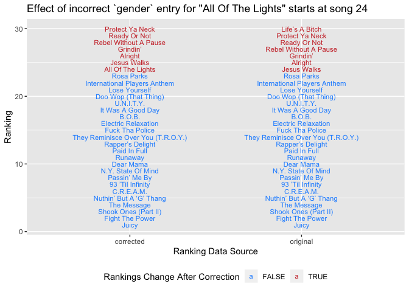

Tidy Tuesday - BBC Best Hip Hop Song Rankings
================
Catalina Moreno
April 14, 2020

## Load libs

``` r
library(tidyverse)
```

## Read in data

``` r
polls <- readr::read_csv('https://raw.githubusercontent.com/rfordatascience/tidytuesday/master/data/2020/2020-04-14/polls.csv')

rankings <- readr::read_csv('https://raw.githubusercontent.com/rfordatascience/tidytuesday/master/data/2020/2020-04-14/rankings.csv')
```

## Initial eda

### `polls` data

``` r
polls %>% glimpse()
```

    Observations: 535
    Variables: 9
    $ rank            <dbl> 1, 2, 3, 4, 5, 1, 2, 3, 4, 5, 1, 2, 3, 4, 5, 1, 2, 3,…
    $ title           <chr> "Terminator X To The Edge of Panic", "4th Chamber", "…
    $ artist          <chr> "Public Enemy", "Gza ft. Ghostface Killah & Killah Pr…
    $ gender          <chr> "male", "male", "male", "male", "male", "male", "mixe…
    $ year            <dbl> 1998, 1995, 1986, 2001, 1994, 1997, 1989, 1986, 1996,…
    $ critic_name     <chr> "Joseph Abajian", "Joseph Abajian", "Joseph Abajian",…
    $ critic_rols     <chr> "Fat Beats", "Fat Beats", "Fat Beats", "Fat Beats", "…
    $ critic_country  <chr> "US", "US", "US", "US", "US", "US", "US", "US", "US",…
    $ critic_country2 <chr> NA, NA, NA, NA, NA, NA, NA, NA, NA, NA, NA, NA, NA, N…

Critic info - check number of entries per unique
critic:

``` r
polls %>% count(critic_name, critic_rols, critic_country, critic_country2) %>% 
  count(n)
```

    # A tibble: 1 x 2
          n    nn
      <int> <int>
    1     5   107

Looks good. Visualize `critic_country`:

``` r
polls %>% 
  group_by(critic_country) %>% mutate(count = n()) %>% 
  ggplot(mapping = aes(x = fct_reorder(critic_country, count)))  + 
  geom_bar() + 
  coord_flip() +
  labs(x = "critic_country")
```

<!-- -->

Critics are primarily from the US.

``` r
polls %>% count(critic_rols) %>% arrange(desc(n)) %>% head(n = 10)
```

    # A tibble: 10 x 2
       critic_rols        n
       <chr>          <int>
     1 Critic           250
     2 Artist            20
     3 Author            15
     4 BBC Music         15
     5 Genius            10
     6 OkayAfrica        10
     7 The FADER         10
     8 Academic           5
     9 Audible Treats     5
    10 Bandcamp           5

A mix of roles and actual institution critic works for.

Look at song info:

``` r
polls %>% 
  count(title) %>% arrange(desc(n)) %>% head(n = 10)
```

    # A tibble: 10 x 2
       title                       n
       <chr>                   <int>
     1 Juicy                      18
     2 Nuthin’ But A ‘G’ Thang    14
     3 The Message                14
     4 Shook Ones (Part II)       13
     5 Fight The Power            11
     6 C.R.E.A.M.                 10
     7 93 ’Til Infinity            7
     8 N.Y. State Of Mind          7
     9 Dear Mama                   6
    10 Jesus Walks                 6

Check all rankings over time:

``` r
polls %>% 
  ggplot(mapping = aes(x = year, y = rank))+ geom_count()
```

<!-- -->

Most ranked songs are in the early-mid 1990’s.

### `rankings` data

Reproduce the ranking system:

``` r
rankings_manual <- polls %>% mutate(score = 12 + -2*rank) %>% 
  group_by(title, artist) %>% summarise(total_points = sum(score),
                                total_votes = n(),
                                total_v1 = sum(rank == 1),
                                total_v2 = sum(rank == 2),
                                total_v3 = sum(rank == 3),
                                total_v4 = sum(rank == 4),
                                total_v5 = sum(rank == 5),
                                check = total_v1 + total_v2 + total_v3 + total_v4 + total_v5) %>% 
  # filter(check != total_votes)
  ungroup() %>% 
  arrange(desc(total_points),
          desc(total_votes),
          desc(total_v1), 
          desc(total_v2),
          desc(total_v3),
          desc(total_v4),
          desc(total_v5)) %>% 
  mutate(score = 1:n()) 
```

Join with `rankings` and see if reproduced results:

``` r
rankings %>% 
  left_join(rankings_manual, by = c("ID" = "score")) %>% 
  filter(title.x != title.y) %>% nrow()
```

    [1] 261

Many rows do not align. Check a few of the top entries for equivalency
in ranking metrics (points, votes etc):

``` r
rankings %>% head(n=20) %>% 
  left_join(rankings_manual %>% head(n = 20), by = c("ID" = "score")) %>% 
  filter(title.x != title.y) %>% nrow()
```

    [1] 0

First 20 titles/scores match. Check if calcualted metrics match:

``` r
rankings %>% head(n=20) %>% mutate(type = "original") %>% 
  select(-ID, -year, -gender) %>% 
  bind_rows(rankings_manual %>% head(n=20) %>% select(-score, -check) %>% 
              rename(points = total_points, 
                     n = total_votes,
                     n1 = total_v1,
                     n2 = total_v2, 
                     n3 = total_v3, 
                     n4 = total_v4,
                     n5 = total_v5) %>%   mutate(type = "manual")) %>% 
  gather(key = "key", value = "value", -artist,-title, -type) %>% 
  spread(key = "type", value = "value") %>% 
  ggplot(mapping = aes(x = manual, y = original)) +
  geom_point() + 
  geom_abline() +
  facet_wrap(~key, scales = "free")
```

<!-- -->

An exact match.

``` r
rankings %>% anti_join(rankings_manual, by = c("title"))
```

    # A tibble: 0 x 12
    # … with 12 variables: ID <dbl>, title <chr>, artist <chr>, year <dbl>,
    #   gender <chr>, points <dbl>, n <dbl>, n1 <dbl>, n2 <dbl>, n3 <dbl>,
    #   n4 <dbl>, n5 <dbl>

And all titles overlap.

Compare distinct `title`, `artist` pairs in `rankings` as it has more
rows than `rankings_manual`:

``` r
rankings %>% count(title, artist) %>% filter(n > 1)
```

    # A tibble: 1 x 3
      title             artist                                n
      <chr>             <chr>                             <int>
    1 All Of The Lights Kanye West ft. Rihanna & Kid Cudi     2

``` r
rankings %>% filter(title %in% c("All Of The Lights"))
```

    # A tibble: 2 x 12
         ID title   artist    year gender points     n    n1    n2    n3    n4    n5
      <dbl> <chr>   <chr>    <dbl> <chr>   <dbl> <dbl> <dbl> <dbl> <dbl> <dbl> <dbl>
    1    43 All Of… Kanye W…  2010 mixed      16     2     0     2     0     0     0
    2    70 All Of… Kanye W…  2010 male       10     1     1     0     0     0     0

It lookes like “All Of The Lights” is incorrectly entered 2x, which
means it’s points are split among two entries. Check its existence in
`polls` data:

``` r
polls %>% filter(title %in% c("All Of The Lights"))
```

    # A tibble: 3 x 9
       rank title artist gender  year critic_name critic_rols critic_country
      <dbl> <chr> <chr>  <chr>  <dbl> <chr>       <chr>       <chr>         
    1     1 All … Kanye… male    2010 Kish Lal    Critic      US            
    2     2 All … Kanye… mixed   2010 Dan Runcie  Trapital    US            
    3     2 All … Kanye… mixed   2010 Jan Wehn    Critic      Germany       
    # … with 1 more variable: critic_country2 <chr>

It appears that one critic entered `gender = male` when it should have
been `mixed`.

Solution: use `rankings_manual` in place of `rankings` to accurately
represent “All Of The Lights” as one song.

### Data correction

Recreate `rankings_manual` to mimic `rankings` more closely, first
fixing `polls` incorrect
entry:

``` r
polls <- polls %>% mutate(gender = ifelse(title %in% "All Of The Lights", "mixed", gender))
```

``` r
rankings_manual_final <- polls %>% 
  mutate(score = 12 + -2*rank) %>% 
  group_by(title, artist) %>% summarise(gender = unique(gender),
                                        year = unique(year),
                                        points = sum(score),
                                        n = n(),
                                        n1 = sum(rank == 1),
                                        n2 = sum(rank == 2),
                                        n3 = sum(rank == 3),
                                        n4 = sum(rank == 4),
                                        n5 = sum(rank == 5)) %>% 
  ungroup() %>% 
  arrange(desc(points),
          desc(n),
          desc(n1), 
          desc(n2),
          desc(n3),
          desc(n4),
          desc(n5)) %>% 
  mutate(ID = 1:n()) 
```

## Top songs eda

Look at top 20 ranked songs:

``` r
rankings_manual_final %>% 
  slice(1:20) %>% 
  ggplot(mapping = aes(x = fct_reorder(title, points), y = points, fill = gender)) + 
  geom_col() + 
  coord_flip() +
  labs(x = "title", title = "Top 20 Ranked Hip-Hop Songs") +
  theme(legend.position = "bottom")
```

<!-- -->

Evaluate all rankings by gender:

``` r
rankings_manual_final %>% 
  ggplot(mapping = aes(x = year, y = points, color = gender)) + geom_point() +
  facet_wrap(~gender)
```

<!-- -->

``` r
rankings %>% 
  ggplot(mapping = aes(x = gender, y = log(points))) + geom_boxplot(varwidth = T) + 
  stat_summary(fun.y = "mean", geom = "point", color = "red") +
  stat_summary(fun.y = "mean", geom = "line", color = "red", mapping = aes(group = 1))
```

<!-- -->

Songs are mostly male, but mean points by gender shows males also score
higher on average compared to females or mixed (note on log scale).

“Juicy” won as the top ranked song by a landslide, but check for artists
ranked across \> 1 song:

``` r
rankings_manual_final %>% 
  distinct(title, artist) %>% count(artist) %>% arrange(desc(n)) %>% 
  filter(n > 1) %>% 
  ggplot(mapping = aes(x = fct_reorder(artist, n), y = n)) + 
  geom_col() +
  coord_flip() +
  labs(x = "Artists w/ > 1 title ranked")
```

<!-- -->

Jay-z’s songs are ranked the most often across critics. How do the
`points` for Jay’Z’s songs compare to the leading song (“Juicy” by The
Notorious B.I.G)?

``` r
rankings_manual_final %>% 
  filter(str_detect(artist, "JAY")) %>% 
  ggplot(mapping = aes(x = fct_reorder(title,points), y = points, fill = artist)) + 
  geom_col() + 
  coord_flip() +
  geom_hline(yintercept = max(rankings_manual_final$points), color = "red", linetype = "dashed") +
  labs(x = "title", title = "Jay-Z's mentioned songs and scores") +
  theme(legend.position = "bottom")
```

<!-- -->

Although Jay-Z has the most mentioned songs, their points are much lower
than the top-ranked song. Also, we see Jay-Z has even more songs than
counted above, as he appears as a solo artist as well as in
collaborations with other artists.

## Summary

This BBC dataset for ranking the top hip hop songs was very tidy. The
only issue I caught was different `gender` entries for the song “All Of
The Lights” which I believe should be considered `gender = mixed`.
Because it had multiple entries (`mixed` and `male`) it was ranked in
two separate entries of the `rankings` data set and did not get the
correct `points` assignment. This means the `rankings` data set is
incorrect starting at ranking 24:

``` r
rankings %>% 
  arrange(desc(points)) %>% 
  slice(1:30) %>% 
  mutate(type = "original") %>% 
  bind_rows(rankings_manual_final %>% 
              arrange(desc(points)) %>% 
              slice(1:30) %>%
              mutate(type = "corrected")) %>% 
  ggplot(mapping = aes(x = ID, y = type, color = ID > 23)) + 
  geom_text(mapping = aes(label = title), size = 3) +
  coord_flip() +
  scale_color_manual(values = c("TRUE" = "brown3", "FALSE" = "dodgerblue")) +
  labs(color = "Rankings Change After Correction", x = "Ranking", y = "Ranking Data Source",
       title = 'Effect of incorrect `gender` entry for "All Of The Lights" starts at song 24') +
  theme(legend.position = "bottom")
```

<!-- -->

“Juicy” by The Notorious B.I.G is still by and far the leading ranked
hip hop song, even after the data correction.
