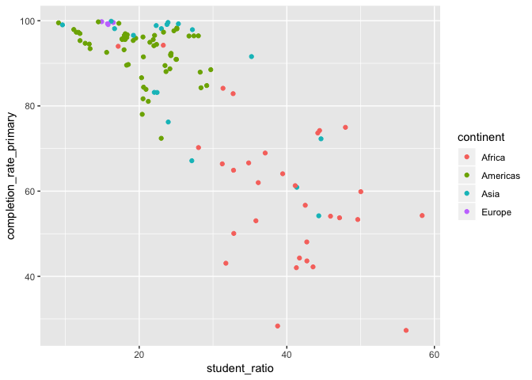

Tidy Tuesday
================
Catalina Moreno
05/07/2019

Read in Data
------------

``` r
library(tidyverse)
student_ratio <- readr::read_csv("https://raw.githubusercontent.com/rfordatascience/tidytuesday/master/data/2019/2019-05-07/student_teacher_ratio.csv")

head(student_ratio)
```

    # A tibble: 6 x 8
      edulit_ind indicator country_code country  year student_ratio flag_codes
      <chr>      <chr>     <chr>        <chr>   <dbl>         <dbl> <chr>     
    1 PTRHC_2    Lower Se… MRT          Maurit…  2013          56.6 <NA>      
    2 PTRHC_2    Lower Se… MRT          Maurit…  2014          51.9 <NA>      
    3 PTRHC_2    Lower Se… MRT          Maurit…  2015          53.2 <NA>      
    4 PTRHC_2    Lower Se… MRT          Maurit…  2016          38.2 <NA>      
    5 PTRHC_1    Primary … COD          Democr…  2012          34.7 <NA>      
    6 PTRHC_1    Primary … COD          Democr…  2013          37.1 <NA>      
    # … with 1 more variable: flags <chr>

Data check
----------

``` r
## numeric
# student_ratio %>% keep(is.numeric) %>% summary()
# 
# ## categorical
# student_ratio %>% count(edulit_ind)
# student_ratio %>% count(country)
# student_ratio %>% count(country_code) 
# ## more country code than countries. check
# student_ratio %>% group_by(country) %>% summarise(check_code = n_distinct(country_code)) %>% filter(check_code > 1)
# student_ratio %>% count(indicator)
# student_ratio %>% count(flag_codes)
# student_ratio %>% count(flags)
```

``` r
student_ratio %>%
  ggplot(mapping = aes(x = student_ratio, y = ..density.., color = factor(year))) + geom_freqpoly() + labs(color = "year")
```


``` r
student_ratio %>% 
  ggplot(mapping = aes(x = student_ratio, y = ..density..,color = indicator)) + geom_freqpoly()
```


``` r
## Saw others using countrycode package to bring in continent info
library(countrycode)
continents <- codelist %>%
  select(iso3c, continent)
```

Check join of continent info:

``` r
student_ratio %>% 
  left_join(continents %>% select(country_code = iso3c, continent), by = "country_code") %>% 
  count(continent)
```

    # A tibble: 6 x 2
      continent     n
      <chr>     <int>
    1 <NA>       1011
    2 Africa      901
    3 Americas    826
    4 Asia       1129
    5 Europe     1154
    6 Oceania     168

Many NA's (failed join), check:

``` r
student_ratio %>% 
  left_join(continents %>% select(country_code = iso3c, continent), by = "country_code") %>% 
  filter(is.na(continent)) %>% 
  group_by(country_code) %>% 
  summarise(country = first(country)) %>% 
  head(n = 10) %>% 
  knitr::kable(caption = "failed joins") 
```

| country\_code | country                          |
|:--------------|:---------------------------------|
| 40030         | Middle income countries          |
| 40041         | High income countries            |
| 40042         | Lower middle income countries    |
| 40043         | Upper middle income countries    |
| 40044         | Low income countries             |
| 40330         | Landlocked Developing Countries  |
| 40334         | Least Developed Countries        |
| 40344         | Small Island Developing States   |
| 40500         | North America and Western Europe |
| 40505         | Central Asia                     |

Numeric country\_codes don't join.

``` r
student_ratio %>% 
  left_join(continents %>% select(country_code = iso3c, continent), by = "country_code") %>% 
  ggplot(mapping = aes(x = student_ratio, y = ..density..,color = continent)) + 
  geom_freqpoly()
```


Lower student\_ratio is better, as it is hypothesized that it improves student achievement:

"research shows that when class size reduction programs are well-designed and implemented in the primary grades (K-3), student achievement rises as class size drops."

To evaluate this further, bring in a measure of student achievment. UNESCO includes data for education completion rates, which could be a measure of student achievement.

Completion Rates
----------------

Downloaded data from [UNESCO](http://data.uis.unesco.org/index.aspx?queryid=180) on 05/07/2019 `Completion rate for primary education (household survey data).`

``` r
completion_rate <- read_csv("completion_primary.csv")
completion_rate %>% count(Indicator)
```

    # A tibble: 99 x 2
       Indicator                                                              n
       <chr>                                                              <int>
     1 Completion rate, primary education, adjusted gender parity index …   156
     2 Completion rate, primary education, adjusted location parity inde…   150
     3 Completion rate, primary education, adjusted wealth parity index …   152
     4 Completion rate, primary education, both sexes (%)                   156
     5 Completion rate, primary education, female (%)                       156
     6 Completion rate, primary education, female, adjusted location par…   150
     7 Completion rate, primary education, female, adjusted wealth parit…   152
     8 Completion rate, primary education, fourth quintile, adjusted gen…   152
     9 Completion rate, primary education, fourth quintile, adjusted loc…   149
    10 Completion rate, primary education, fourth quintile, both sexes (…   152
    # … with 89 more rows

First check join success to student\_ratio, joining by country\_code and year:

``` r
completion_rate %>% select(country_code = LOCATION) %>% distinct(country_code) %>% 
  inner_join(student_ratio %>% distinct(country_code), by = "country_code") %>% nrow
```

    [1] 87

Join and visualize completion rates vs. student\_ratio by continent for Primary Education only:

``` r
completion_rate %>% 
  filter(Indicator %in% "Completion rate, primary education, both sexes (%)") %>% 
  select(country_code = LOCATION, year = Time, completion_rate_primary = Value, Indicator) %>% 
  inner_join(student_ratio %>% filter(indicator %in% "Primary Education"), 
             by = c("country_code", "year")) %>% 
  left_join(continents %>% select(country_code = iso3c, continent), by = "country_code" ) %>% 
  ggplot(mapping = aes(x = student_ratio, y = completion_rate_primary, color = continent)) +
  geom_point()
```



This visual supports the hypothesis that completion rate of primary education decreases with increasing student\_ratio. However, it is important to point out that these data are at joined by the same year, and may not line up. Specifically, we will not know the effect of the student\_ratio on completion rates until primary education is finished, which is likely not in the same year... Nevertheless, this figure could suggest a lagged effect if student\_ratios are in each country are ~ constant over time.

The countries from Asia show a range of completion rates at student\_ratio ~ 25. It would be interesting to learn the differences in how the class size reduction programs differed in "design" here.
