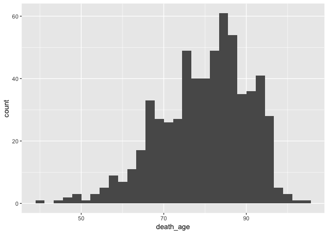
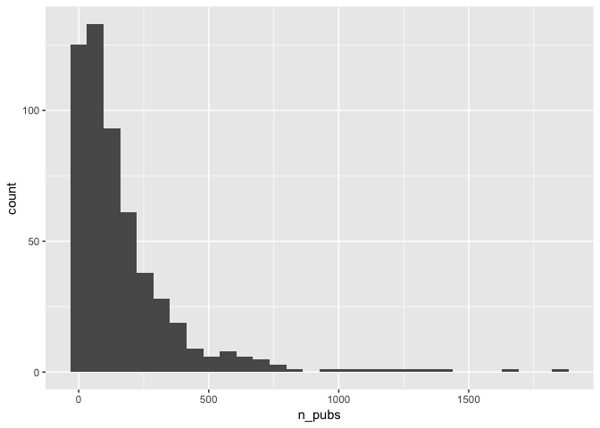

Tidy Tuesday - Nobel Prize Winners Dataset
================
Catalina Moreno
May 15, 2019

Read in Data
------------

Two datasets from GitHub:

``` r
nobel_winners <- readr::read_csv("https://raw.githubusercontent.com/rfordatascience/tidytuesday/master/data/2019/2019-05-14/nobel_winners.csv")
nobel_winner_all_pubs <- readr::read_csv("https://raw.githubusercontent.com/rfordatascience/tidytuesday/master/data/2019/2019-05-14/nobel_winner_all_pubs.csv")
```

``` r
nobel_winners %>% glimpse
```

    Observations: 969
    Variables: 18
    $ prize_year           <dbl> 1901, 1901, 1901, 1901, 1901, 1901, 1902, 1…
    $ category             <chr> "Chemistry", "Literature", "Medicine", "Pea…
    $ prize                <chr> "The Nobel Prize in Chemistry 1901", "The N…
    $ motivation           <chr> "\"in recognition of the extraordinary serv…
    $ prize_share          <chr> "1/1", "1/1", "1/1", "1/2", "1/2", "1/1", "…
    $ laureate_id          <dbl> 160, 569, 293, 462, 463, 1, 161, 571, 294, …
    $ laureate_type        <chr> "Individual", "Individual", "Individual", "…
    $ full_name            <chr> "Jacobus Henricus van 't Hoff", "Sully Prud…
    $ birth_date           <date> 1852-08-30, 1839-03-16, 1854-03-15, 1828-0…
    $ birth_city           <chr> "Rotterdam", "Paris", "Hansdorf (Lawice)", …
    $ birth_country        <chr> "Netherlands", "France", "Prussia (Poland)"…
    $ gender               <chr> "Male", "Male", "Male", "Male", "Male", "Ma…
    $ organization_name    <chr> "Berlin University", NA, "Marburg Universit…
    $ organization_city    <chr> "Berlin", NA, "Marburg", NA, NA, "Munich", …
    $ organization_country <chr> "Germany", NA, "Germany", NA, NA, "Germany"…
    $ death_date           <date> 1911-03-01, 1907-09-07, 1917-03-31, 1910-1…
    $ death_city           <chr> "Berlin", "Châtenay", "Marburg", "Heiden", …
    $ death_country        <chr> "Germany", "France", "Germany", "Switzerlan…

``` r
nobel_winner_all_pubs %>% glimpse()
```

    Observations: 93,394
    Variables: 11
    $ laureate_id            <dbl> 20001, 20001, 20001, 20001, 20001, 20001,…
    $ laureate_name          <chr> "stoddart, j", "stoddart, j", "stoddart, …
    $ prize_year             <dbl> 2016, 2016, 2016, 2016, 2016, 2016, 2016,…
    $ title                  <chr> "a molecular shuttle", "chemical synthesi…
    $ pub_year               <dbl> 1991, 1993, 1981, 2005, 1974, 1982, 1996,…
    $ paper_id               <dbl> 1976038872, 1963538048, 1963552001, 20956…
    $ doi                    <chr> "10.1021/ja00013a096", "10.1557/PROC-330-…
    $ journal                <chr> "journal of the american chemical society…
    $ affiliation            <chr> "northwestern university", "northwestern …
    $ is_prize_winning_paper <chr> "YES", "NO", "NO", "NO", "NO", "NO", "NO"…
    $ category               <chr> "chemistry", "chemistry", "chemistry", "c…

Initial EDA
-----------

nobel\_winners dataset:

``` r
nobel_winners %>% count(category)
```

    # A tibble: 6 x 2
      category       n
      <chr>      <int>
    1 Chemistry    194
    2 Economics     83
    3 Literature   113
    4 Medicine     227
    5 Peace        130
    6 Physics      222

``` r
nobel_winners %>% mutate(death_age = as.numeric(difftime(death_date, birth_date, units = "days"))/365.25) %>% ggplot(mapping = aes(x = death_age)) + geom_histogram()
```



Many Nobel Prize winners live long lives.

nobel\_winner\_all\_pubs dataset:

``` r
nobel_winner_all_pubs %>% count(category)
```

    # A tibble: 3 x 2
      category      n
      <chr>     <int>
    1 chemistry 42657
    2 medicine  29233
    3 physics   21504

``` r
nobel_winner_all_pubs %>% 
  group_by(laureate_id) %>% 
  summarize(n_pubs = n_distinct(paper_id), 
            prize_year_check = n_distinct(prize_year),
            prize_year = first(prize_year)) %>% 
  ggplot(mapping = aes(x = n_pubs)) + geom_histogram() 
```



Some &gt; 1000 pubs... who?

``` r
nobel_winner_all_pubs %>% 
  group_by(laureate_id) %>% 
  summarize(n_pubs = n_distinct(paper_id), 
            prize_year_check = n_distinct(prize_year),
            prize_year = first(prize_year),
            category = first(category)) %>% 
  filter(n_pubs > 1000)
```

    # A tibble: 9 x 5
      laureate_id n_pubs prize_year_check prize_year category 
            <dbl>  <int>            <int>      <dbl> <chr>    
    1       20001   1205                1       2016 chemistry
    2       20018   1059                1       2010 chemistry
    3       20041   1035                1       2000 chemistry
    4       20056   1853                1       1994 chemistry
    5       20061   1401                1       1990 chemistry
    6       20084   1630                1       1979 chemistry
    7       20098   1278                1       1969 chemistry
    8       30003   1134                1       2015 medicine 
    9       30091   1313                1       1977 medicine 

Check join of two datasets
--------------------------

Can join datasets by `laureate_id`?

``` r
nobel_winner_all_pubs %>% distinct(laureate_id) %>% 
  inner_join(nobel_winners %>% distinct(laureate_id), by = "laureate_id") %>% nrow()
```

    [1] 0

Nothing joined by `laureate_id`... try names:

``` r
nobel_winners %>% 
  mutate(lastname = str_extract(str_to_lower(full_name), "[:alpha:]*$")) %>% 
  select(lastname) %>% 
  inner_join(nobel_winner_all_pubs %>% 
               mutate(lastname = str_extract(laureate_name, "^[:alpha:]*")) %>% 
               distinct(lastname), 
             by = "lastname") %>% nrow()
```

    [1] 537

Joined!

More EDA
--------

Plot \# pubs/year by cateogry to see how has changed over time. Include info on if winners are all male or have females:

``` r
nobel_winner_all_pubs %>% mutate(lastname = str_extract(laureate_name, "^[:alpha:]*")) %>% 
  left_join(nobel_winners %>% 
              mutate(lastname = str_extract(str_to_lower(full_name), "[:alpha:]*$")) %>% 
              select(lastname, gender), by = "lastname") %>% 
  group_by(category, prize_year) %>% 
  summarise(n_winner = n_distinct(laureate_id),
            n_pubs = n_distinct(paper_id),
            paper_per_winner = n_pubs/n_winner,
            includes_female = any(gender %in% "Female")) %>% 
  ggplot(mapping = aes(x = prize_year, y = log(paper_per_winner), color = category)) + 
  geom_point(mapping = aes(shape = includes_female)) + 
  geom_smooth(method = "lm") + facet_wrap(~category) +
  scale_shape_manual(values = c("TRUE" = 4, "FALSE" = 16)) +
  theme(legend.position = "bottom") +
  labs(title = "Log Count Pubs per Nobel Prize Winner, by Prize Year")
```


Increase in \# pubs/winner over the years; could indicate the pressure on scientists to publish.
