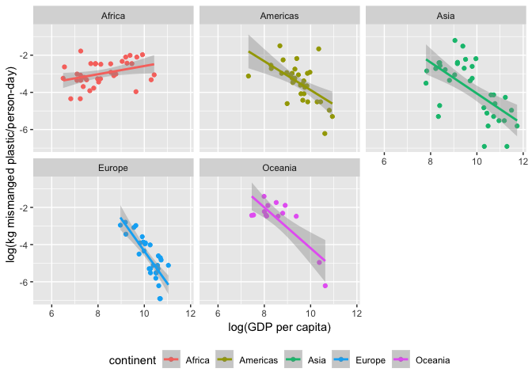

Tidy Tuesday 05-21-2019
================
Catalina Moreno
May 24, 2019

Read in
-------

``` r
coast_vs_waste <- readr::read_csv("https://raw.githubusercontent.com/rfordatascience/tidytuesday/master/data/2019/2019-05-21/coastal-population-vs-mismanaged-plastic.csv")

mismanaged_vs_gdp <- readr::read_csv("https://raw.githubusercontent.com/rfordatascience/tidytuesday/master/data/2019/2019-05-21/per-capita-mismanaged-plastic-waste-vs-gdp-per-capita.csv")

waste_vs_gdp <- readr::read_csv("https://raw.githubusercontent.com/rfordatascience/tidytuesday/master/data/2019/2019-05-21/per-capita-plastic-waste-vs-gdp-per-capita.csv")
```

### coast\_vs\_waste

``` r
coast_vs_waste %>% head()
```

    # A tibble: 6 x 6
      Entity  Code   Year `Mismanaged plast… `Coastal popula… `Total populatio…
      <chr>   <chr> <dbl>              <dbl>            <dbl>             <dbl>
    1 Afghan… AFG    1800                 NA               NA           3280000
    2 Afghan… AFG    1820                 NA               NA           3280000
    3 Afghan… AFG    1870                 NA               NA           4207000
    4 Afghan… AFG    1913                 NA               NA           5730000
    5 Afghan… AFG    1950                 NA               NA           8151455
    6 Afghan… AFG    1951                 NA               NA           8276820

``` r
coast_vs_waste %>% purrr::map_df(function(x) {sum(is.na(x))}) %>% 
  knitr::kable(caption = "Count of Missing Values")
```

|  Entity|  Code|  Year|  Mismanaged plastic waste (tonnes)|  Coastal population|  Total population (Gapminder)|
|-------:|-----:|-----:|----------------------------------:|-------------------:|-----------------------------:|
|       0|     0|     0|                              19906|               19907|                            12|

Appears to be a lot of missing data.

``` r
coast_vs_waste %>% na.omit() %>% nrow() 
```

    [1] 175

``` r
coast_vs_waste %>% na.omit() %>% distinct(Year)
```

    # A tibble: 1 x 1
       Year
      <dbl>
    1  2010

``` r
# coast_vs_waste %>% na.omit() %>% distinct(Entity) 
coast_vs_waste %>% na.omit() %>% count(Entity) %>% count(n)
```

    # A tibble: 1 x 2
          n    nn
      <int> <int>
    1     1   175

Full data for year 2010, 175 different countries.

``` r
coast_vs_waste %>% na.omit() %>% ggplot(mapping = aes(x = `Mismanaged plastic waste (tonnes)`)) + geom_histogram() + facet_wrap(~Year)
```


Right-skew, try log-transform:

``` r
coast_vs_waste %>% na.omit() %>% ggplot(mapping = aes(x = log(`Mismanaged plastic waste (tonnes)`))) + geom_histogram() + facet_wrap(~Year)
```


Check relationship between Population and Mismanaged Plastic Waste:

``` r
coast_vs_waste %>% 
  select(`Mismanaged plastic waste (tonnes)`, `Total population (Gapminder)`, `Coastal population`) %>% 
  tidyr::gather(key = "key", value = "value", -`Mismanaged plastic waste (tonnes)`) %>% 
  ggplot(mapping = aes(x = log(value), y = log(`Mismanaged plastic waste (tonnes)`), color = key)) + 
  geom_point() + 
  geom_smooth(method = "lm") + 
  facet_wrap(~key) +
  theme(legend.position = "bottom") +
  labs(x = "log(population)", title = "Log-Log Relationship")
```


Strong relationship between log-pop and log-mismanaged plastic.

Check pop vs time:

``` r
coast_vs_waste %>% 
  ggplot(mapping = aes(x = Year, y = `Total population (Gapminder)`, group = Code)) + geom_line()
```


Which are the two lines with largest populations?

``` r
coast_vs_waste %>% filter(`Total population (Gapminder)` > 5e8) %>% distinct(Code)
```

    # A tibble: 2 x 1
      Code 
      <chr>
    1 CHN  
    2 IND  

Can bring in continent info and color?

``` r
library(countrycode)
continents <- codelist %>%
  select(iso3c, continent)

coast_vs_waste %>% 
  left_join(continents %>% select(Code = iso3c, continent), by = "Code") %>% 
    filter(!is.na(continent)) %>% 
  ggplot(mapping = aes(x = Year, y = `Total population (Gapminder)`, group = Code, color = continent)) + geom_line() + facet_wrap(~continent)
```


### mismanaged\_vs\_gdp

``` r
mismanaged_vs_gdp %>% head()
```

    # A tibble: 6 x 6
      Entity  Code   Year `Per capita misma… `GDP per capita,… `Total populati…
      <chr>   <chr> <dbl>              <dbl>             <dbl>            <dbl>
    1 Afghan… AFG    1800                 NA                NA          3280000
    2 Afghan… AFG    1820                 NA                NA          3280000
    3 Afghan… AFG    1870                 NA                NA          4207000
    4 Afghan… AFG    1913                 NA                NA          5730000
    5 Afghan… AFG    1950                 NA                NA          8151455
    6 Afghan… AFG    1951                 NA                NA          8276820

Assume Total pop is same as coast\_vs\_waste, check:

``` r
## check join
coast_vs_waste %>% select(Code, Year, `Total population (Gapminder)`) %>% 
  inner_join(mismanaged_vs_gdp %>% select(Code, Year, `Total population (Gapminder)`),
             by = c("Code", "Year")) %>% 
  ggplot(mapping = aes(x = `Total population (Gapminder).x`, y = `Total population (Gapminder).y`)) +
  geom_point(alpha = 0.5) + 
  geom_abline()
```


Same. Check missing values in this dataset:

``` r
mismanaged_vs_gdp %>% purrr::map_df(function(x) {sum(is.na(x))}) %>% knitr::kable(caption = "Count of Missing Values")
```

|  Entity|  Code|  Year|  Per capita mismanaged plastic waste (kilograms per person per day)|  GDP per capita, PPP (constant 2011 international $) (Rate)|  Total population (Gapminder)|
|-------:|-----:|-----:|-------------------------------------------------------------------:|-----------------------------------------------------------:|-----------------------------:|
|       0|  1240|     0|                                                               22018|                                                       15797|                          2123|

``` r
mismanaged_vs_gdp %>% na.omit() %>% distinct(Year)
```

    # A tibble: 1 x 1
       Year
      <dbl>
    1  2010

Also 2010 only.

Check GDP per capita over time:

``` r
mismanaged_vs_gdp %>% filter(!is.na(`GDP per capita, PPP (constant 2011 international $) (Rate)`)) %>% 
  ggplot(mapping = aes(x = Year, y = `GDP per capita, PPP (constant 2011 international $) (Rate)`, group = Code)) + geom_line()
```


One group that looks like &gt;1 value per year?

``` r
mismanaged_vs_gdp %>% 
  count(Entity, Year) %>% 
  filter(n > 1) 
```

    # A tibble: 0 x 3
    # … with 3 variables: Entity <chr>, Year <dbl>, n <int>

Nothing comes up.

Visualize per capita GDP vs per capita mismanaged waste, by continent:

``` r
mismanaged_vs_gdp %>% filter(!is.na(`GDP per capita, PPP (constant 2011 international $) (Rate)`)) %>% 
  left_join(continents %>% select(Code = iso3c, continent), by = "Code") %>% 
  filter(!is.na(continent)) %>% 
  ggplot(mapping = aes(x = log(`GDP per capita, PPP (constant 2011 international $) (Rate)`),
                       y = log(`Per capita mismanaged plastic waste (kilograms per person per day)`),
                       color = continent)) + 
  geom_point() +
  geom_smooth(method = "lm") +
  facet_wrap(~continent) + 
  labs(y = "log(kg mismanged plastic/person-day)", x = "log(GDP per capita)") +
  theme(legend.position = "bottom")
```



All continents except Africa show decrease in mismanaged plastic with increase in GDP in 2010.

### waste\_vs\_gdp

``` r
waste_vs_gdp %>% head()
```

    # A tibble: 6 x 6
      Entity  Code   Year `Per capita plast… `GDP per capita,… `Total populati…
      <chr>   <chr> <dbl>              <dbl>             <dbl>            <dbl>
    1 Afghan… AFG    1800                 NA                NA          3280000
    2 Afghan… AFG    1820                 NA                NA          3280000
    3 Afghan… AFG    1870                 NA                NA          4207000
    4 Afghan… AFG    1913                 NA                NA          5730000
    5 Afghan… AFG    1950                 NA                NA          8151455
    6 Afghan… AFG    1951                 NA                NA          8276820

``` r
waste_vs_gdp %>% na.omit() %>% distinct(Year)
```

    # A tibble: 1 x 1
       Year
      <dbl>
    1  2010

2010 only as well.

Lastly compare per capita plastic vs per capit mismangaged plastic, bring in continent information, too:

``` r
mismanaged_vs_gdp %>% select(mismanaged = `Per capita mismanaged plastic waste (kilograms per person per day)`, Code, Year) %>% 
  filter(!is.na(mismanaged)) %>% 
  inner_join(waste_vs_gdp %>% 
               select(Code, Year, plastic= `Per capita plastic waste (kilograms per person per day)`), 
             by = c("Code", "Year")) %>% 
  left_join(continents %>% select(continent, Code = iso3c), by= "Code") %>% 
  ggplot(mapping = aes(x = plastic, y = mismanaged, color = continent)) + 
  geom_point() + 
  facet_wrap(~continent, scales = "free_x") + 
  theme(legend.position = "bottom")
```


