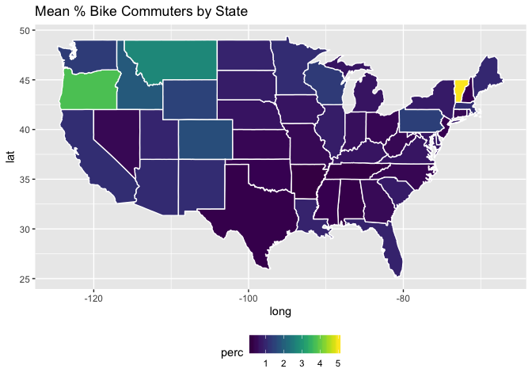

Tidy Tuesday - Walk vs. Bike State Data
================
Catalina Moreno
November 06, 2019

Read in Data
------------

``` r
library(tidyverse)

commute_mode <- readr::read_csv("https://raw.githubusercontent.com/rfordatascience/tidytuesday/master/data/2019/2019-11-05/commute.csv")
```

Check data
----------

``` r
commute_mode %>% glimpse()
```

    Observations: 3,496
    Variables: 9
    $ city         <chr> "Aberdeen city", "Acworth city", "Addison village",…
    $ state        <chr> "South Dakota", "Georgia", "Illinois", "California"…
    $ city_size    <chr> "Small", "Small", "Small", "Small", "Small", "Small…
    $ mode         <chr> "Bike", "Bike", "Bike", "Bike", "Bike", "Bike", "Bi…
    $ n            <dbl> 110, 0, 43, 0, 121, 0, 84, 23, 0, 576, 35, 77, 419,…
    $ percent      <dbl> 0.8, 0.0, 0.2, 0.0, 1.5, 0.0, 0.8, 0.2, 0.0, 1.5, 0…
    $ moe          <dbl> 0.5, 0.4, 0.3, 0.5, 1.0, 0.2, 1.1, 0.3, 0.2, 0.4, 0…
    $ state_abb    <chr> "SD", "GA", "IL", "CA", "MI", "MA", "CA", "SC", "AL…
    $ state_region <chr> "North Central", "South", "North Central", "West", …

Any missing data?

``` r
commute_mode %>% purrr::map_df(function(x) {sum(is.na(x))})
```

    # A tibble: 1 x 9
       city state city_size  mode     n percent   moe state_abb state_region
      <int> <int>     <int> <int> <int>   <int> <int>     <int>        <int>
    1     0     0         0     0     0       0     0         4            4

Check missing data:

``` r
commute_mode %>% filter(is.na(state_abb))
```

    # A tibble: 4 x 9
      city     state city_size mode      n percent   moe state_abb state_region
      <chr>    <chr> <chr>     <chr> <dbl>   <dbl> <dbl> <chr>     <chr>       
    1 El Paso… Ca    Small     Bike     71     0.5   0.4 <NA>      <NA>        
    2 West Sp… Mass… Small     Bike     23     0.2   0.2 <NA>      <NA>        
    3 Washing… Dist… Large     Bike   9347     3.1   0.2 <NA>      <NA>        
    4 Washing… Dist… Large     Walk  37055    12.1   0.5 <NA>      <NA>        

Fix DC:

``` r
commute_mode <- commute_mode %>% mutate(state_abb = ifelse(state %in% "District of Columbia", "DC", state_abb))
## assign region, checking VA/MD
commute_mode %>% filter(state_abb %in% c("VA", "MD")) %>% distinct(state_region)
```

    # A tibble: 1 x 1
      state_region
      <chr>       
    1 South       

``` r
commute_mode <- commute_mode %>% mutate(state_region = ifelse(state %in% "District of Columbia", "South", state_region))
```

See error for two others cities.

``` r
commute_mode %>% filter(city %in% c("El Paso de Robles (Paso Robles) city", "West Springfield Town city"))
```

    # A tibble: 4 x 9
      city     state city_size mode      n percent   moe state_abb state_region
      <chr>    <chr> <chr>     <chr> <dbl>   <dbl> <dbl> <chr>     <chr>       
    1 El Paso… Ca    Small     Bike     71     0.5   0.4 <NA>      <NA>        
    2 West Sp… Mass… Small     Bike     23     0.2   0.2 <NA>      <NA>        
    3 El Paso… Cali… Small     Walk    203     1.6   0.8 CA        West        
    4 West Sp… Mass… Small     Walk    286     2.1   1.2 MA        Northeast   

Fix:

``` r
# state_abb and state_region missing
commute_mode <- commute_mode %>% 
  mutate(state_abb = ifelse(city %in% "El Paso de Robles (Paso Robles) city", "CA", state_abb),
         state_abb = ifelse(city %in% "West Springfield Town city", "MA", state_abb),
         state_region = ifelse(city %in% "El Paso de Robles (Paso Robles) city", "West", state_region),
         state_region = ifelse(city %in% "West Springfield Town city", "Northeast", state_region),
         state = ifelse(city %in% "El Paso de Robles (Paso Robles) city", "California", state),
         state = ifelse(city %in% "West Springfield Town city", "Massachusetts", state))
```

Now check \# entries per city/state:

``` r
commute_mode %>% 
  group_by(city, state) %>% 
  summarise(num_mode = n_distinct(mode)) %>% 
  ggplot(mapping = aes(x = num_mode)) + geom_bar(width = 0.5) + labs(title = "# entries per city (for a mode)")
```


Check state\_abb vs state:

``` r
commute_mode %>% distinct(state) %>% nrow()
```

    [1] 51

``` r
commute_mode %>% distinct(state_abb) %>% nrow()
```

    [1] 51

EDA
---

``` r
commute_mode %>% 
  group_by(state_abb) %>% mutate(count = n_distinct(city)) %>% 
  ungroup() %>% 
  mutate(state_abb = factor(state_abb)) %>% 
  ggplot(mapping = aes(x = forcats::fct_reorder(state_abb, count), fill = state_region)) + 
  geom_bar() + coord_flip() +
  labs(x = "State Abb", title = "# entries per state (# polled cities)") +
  theme(legend.position = "bottom")
```


The number of cities polled is unbalanced across states, CA particularly.

``` r
commute_mode %>% 
  group_by(state_abb) %>% mutate(count = n_distinct(city)) %>% 
  ungroup() %>% 
  mutate(state_abb = factor(state_abb)) %>% 
  ggplot(mapping = aes(x = forcats::fct_reorder(state_abb, count), fill = city_size)) + 
  geom_bar() + coord_flip() +
  labs(x = "State Abb", title = "# entries per state (# polled cities)") +
  theme(legend.position = "bottom")
```


Mostly small cities polled.

Visualize percents:

``` r
commute_mode %>% 
  ggplot(mapping = aes(x = percent, color = mode)) + geom_freqpoly() + 
  facet_grid(city_size ~ state_region, scales = "free")
```


Northeast demonstrates the biggest difference between Bike and Walk; overall more Walkers than Bikers, but neither commute mode is very high.

Check the margin of error (MOE):

``` r
commute_mode %>% 
  ggplot(mapping = aes(x = moe,  y = ..density.., color = mode)) + geom_freqpoly() + 
  facet_grid(state_region ~ city_size)
```


Oddities with dataset:
----------------------

Where is MOE &gt; percent?

``` r
commute_mode %>% filter(moe > percent) %>% nrow()
```

    [1] 434

These CI would span zero percent.

MOE when n = 0?

``` r
commute_mode %>% filter(n == 0) %>% 
  ggplot(mapping = aes(x = moe)) + geom_histogram() +
  labs(title = "Margin of error on n = 0 observations")
```


How are CI's calculated if n = 0?

``` r
commute_mode %>% pull(n) %>% summary()
```

        Min.  1st Qu.   Median     Mean  3rd Qu.     Max. 
         0.0     59.0    190.0    847.9    529.0 378352.0 

``` r
commute_mode %>% arrange(desc(n)) %>% head()
```

    # A tibble: 6 x 9
      city    state city_size mode       n percent   moe state_abb state_region
      <chr>   <chr> <chr>     <chr>  <dbl>   <dbl> <dbl> <chr>     <chr>       
    1 New Yo… New … Large     Walk  378352    10.3   0.1 NY        Northeast   
    2 Chicag… Illi… Large     Walk   77753     6.4   0.2 IL        North Centr…
    3 Los An… Cali… Large     Walk   63917     3.7   0.1 CA        West        
    4 Philad… Penn… Large     Walk   51760     8.6   0.3 PA        Northeast   
    5 Boston… Mass… Large     Walk   47880    15.1   0.5 MA        Northeast   
    6 San Fr… Cali… Large     Walk   43363     9.9   0.4 CA        West        

Paper lists NYC with values &gt; 3e6. What are units here? Difficulties aligning with values in paper.

Bring in other info
-------------------

``` r
acs_data <- read_csv("https://raw.githubusercontent.com/rfordatascience/tidytuesday/master/data/2019/2019-11-05/table_3.csv")

age_data <- acs_data %>% 
  slice(1:6)

gender_data <- acs_data %>% 
  slice(9:10) %>% 
  rename("gender" = age)

race_data <- acs_data %>% 
  slice(13:18) %>% 
  rename("race" = age)

children_data <- acs_data %>% 
  slice(20:24) %>% 
  rename("children" = age)

income_data <- acs_data %>% 
  slice(27:36) %>% 
  rename("income" = age)

education_data <- acs_data %>% 
  slice(39:43) %>% 
  rename("education" = age)
```

``` r
age_data %>% select(val = age, bike_percent, walk_percent) %>% mutate(type = "age") %>% 
  bind_rows(education_data %>% select(val = education, bike_percent, walk_percent) %>% 
              mutate(type = "edu")) %>%
    bind_rows(gender_data %>% select(val = gender, bike_percent, walk_percent) %>% 
              mutate(type = "gender")) %>% 
    bind_rows(race_data %>% select(val = race, bike_percent, walk_percent) %>% 
              mutate(type = "race")) %>% 
    bind_rows(children_data %>% slice(-1) %>%  select(val = children, bike_percent, walk_percent) %>% 
              mutate(type = "children")) %>% 
    bind_rows(income_data %>% select(val = income, bike_percent, walk_percent) %>% 
              mutate(type = "income")) %>% 
  ggplot(mapping = aes(x = fct_reorder(val, bike_percent), y = bike_percent, fill = type)) + 
  geom_col() + 
  facet_grid(type~., scales = "free") +
  coord_flip() +
  labs(x = "", y = "%", title = "% Bikers by Deomgraphic Groups") +
  theme(legend.position = "bottom")
```


Reproduce figs from paper
-------------------------

Princiapl cities have rate of 4.3% of walking to work according to paper, true?

``` r
commute_mode %>% 
  filter(n > 0, percent > 0) %>% 
  mutate(denom = n/(percent/100)) %>% 
  group_by(city_size, mode) %>% summarise(unweighted_perc = sum(n)/sum(denom)*100) %>% 
  ggplot(mapping = aes(x = mode, fill = city_size, y = unweighted_perc)) + 
  geom_col(position = "dodge") +
  labs(y = "% Commuters")
```


Unsure what is meant by principal cities, but Large city % is ~4.5%.

``` r
commute_mode %>% filter(mode %in% "Bike") %>% arrange(desc(percent)) %>% head(n = 5)
```

    # A tibble: 5 x 9
      city    state  city_size mode      n percent   moe state_abb state_region
      <chr>   <chr>  <chr>     <chr> <dbl>   <dbl> <dbl> <chr>     <chr>       
    1 Davis … Calif… Small     Bike   5691    18.6   1.8 CA        West        
    2 Key We… Flori… Small     Bike   2439    17.4   2.9 FL        South       
    3 Corval… Oregon Small     Bike   2804    11.2   1.5 OR        West        
    4 Boulde… Color… Medium    Bike   5507    10.5   1   CO        West        
    5 Santa … Calif… Small     Bike   2697     9.2   1.7 CA        West        

``` r
commute_mode %>% filter(mode %in% "Walk") %>% arrange(desc(percent)) %>% head(n = 5)
```

    # A tibble: 5 x 9
      city    state  city_size mode      n percent   moe state_abb state_region
      <chr>   <chr>  <chr>     <chr> <dbl>   <dbl> <dbl> <chr>     <chr>       
    1 Ithaca… New Y… Small     Walk   5575    42.4   3.8 NY        Northeast   
    2 Athens… Ohio   Small     Walk   3461    36.8   5.4 OH        North Centr…
    3 State … Penns… Small     Walk   5486    36.2   3.2 PA        Northeast   
    4 North … Illin… Small     Walk   5741    32.2   4.2 IL        North Centr…
    5 Kiryas… New Y… Small     Walk   1166    31.6   4.2 NY        Northeast   

``` r
commute_mode %>% filter(str_detect(city, "Portland"), state %in% "Oregon")
```

    # A tibble: 2 x 9
      city     state city_size mode      n percent   moe state_abb state_region
      <chr>    <chr> <chr>     <chr> <dbl>   <dbl> <dbl> <chr>     <chr>       
    1 Portlan… Oreg… Large     Bike  18315     6.1   0.3 OR        West        
    2 Portlan… Oreg… Large     Walk  17030     5.7   0.4 OR        West        

These values check out.

Try to recreate figure 4:

``` r
commute_mode %>% 
  filter(mode %in% "Walk") %>% 
  filter(n > 0, percent >0) %>% 
  mutate(denom = n/(percent/100)) %>% 
  group_by(state_region, city_size) %>% summarise(unweighted_perc = sum(n)/sum(denom)*100) %>% 
  ggplot(mapping = aes(x = state_region, y = unweighted_perc, fill = city_size)) +
  geom_col(position = "dodge") +
  labs(y = "% Walk Commuters", x = "Region")
```


Try spatial views:

``` r
us <- map_data("state")
us %>% 
  left_join(commute_mode %>% 
              mutate(state = str_to_lower(state)) %>% 
              group_by(state) %>% summarise(num_polled_cities = n_distinct(city)),
            by = c("region" = "state")) %>% 
ggplot(mapping = aes(x = long, y = lat, group = group, fill = num_polled_cities)) +
  geom_polygon(colour = "white") + 
  theme(legend.position = "bottom") +
  viridis::scale_fill_viridis() + labs(title = "# of polled cities/state in ACS data")
```


Visualize % bike commuter by state; instead of averaging %'s within state (bc not equally weighted), calculate total by city and aggregate total polled and total bikers.

``` r
## unweight?
us %>% 
  left_join(commute_mode %>% 
              mutate(state = str_to_lower(state)) %>% 
              filter(n > 0, percent > 0, mode %in% "Bike") %>% 
              mutate(denom = n/(percent/100)) %>% 
              group_by(state) %>% 
              summarise(perc = sum(n)/sum(denom)*100),
            by = c("region" = "state")) %>% 
  ggplot(mapping = aes(x = long, y = lat, group = group, fill = perc)) +
  geom_polygon(colour = "white") + 
  theme(legend.position = "bottom") +
  viridis::scale_fill_viridis(discrete = FALSE) + labs(title = "Mean % Bike Commuters by State")
```



Summary
-------

Overall, could not quite recreate aggregate % values, but close. Required reversing percents to find total polled within city, and aggregating total commuter by total polled within desired group (state, region, city size etc).

Also, a few additional data cleaning steps; and would be interested to learn how MOE were calcualted.

Surprised that the % of walkers and bikers is so low, especially in the south where the weather is warmer. Also surprised how data was collected -- mostly small cities and a lot in California.
