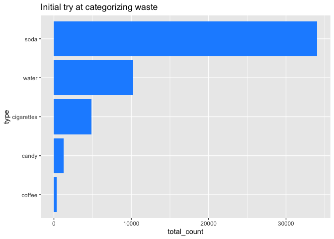
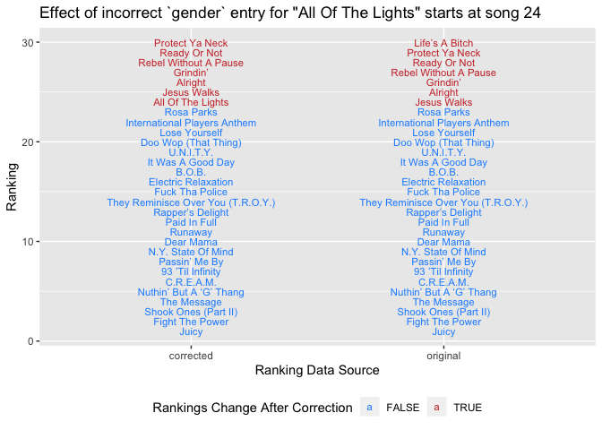
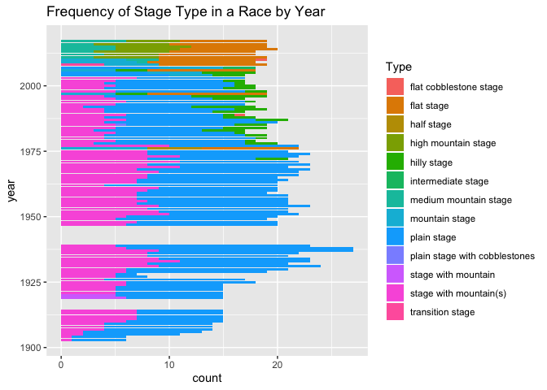
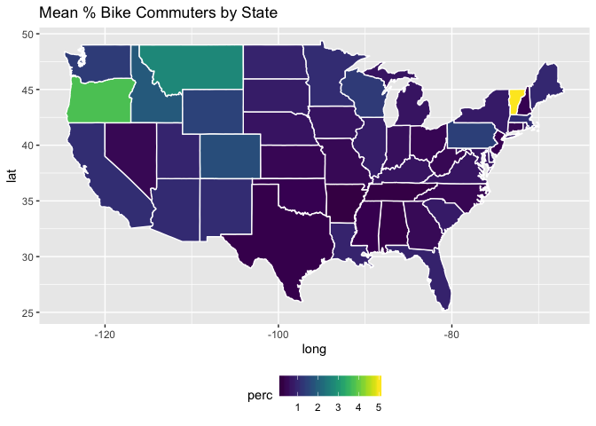
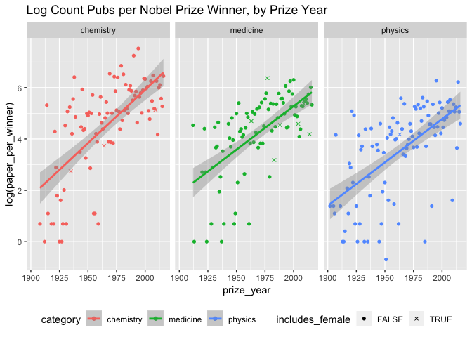
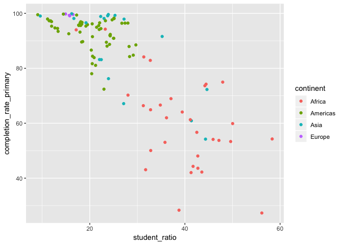

## Overview

Key figures and takeaways from `tidytuesday` participation:

* **01-26-2021** eval of data from Break Free From Plastic initiative; top cont$

* **04-14-2020:** BBC top rankings for hip-hop artists; one discrepancy found with `gender` entry for "All Of The Lights" (both `mixed` and `male` are entered). If this is resolved, the rankings are affected starting at song 24

* **04-07-2020:** TDF data

* **11-05-2019:** ACS bike/walk commuter data

* **05-14-2019:** nobel prize winners dataset, eda on how #pubs/year have changed over time

* **05-07-2019:** student ratio data and eda on how effects student achievement

